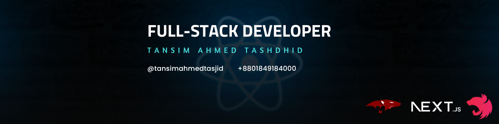

### 
I'm Tansim Ahmed Tashdid 

<!-- 
 A full-time full-stack developer 👨‍💻
 -->

 
Backend Software Engineer specializing in microservices, distributed systems, and scalable application architecture. Experienced in building secure, high-performance backend systems with clean and maintainable design. Focused on solving real-world problems through thoughtful engineering, system optimization, and collaborative development. Passionate about backend architecture, DevOps, and scalable infrastructure.
 

 

- 💬 Ask me about **Nest.js, Backend Architecture & Microservices**

- 📫 How to reach me **tansimahmedtasjid@gmail.com**

- 🔗 LinkedIn: [tansim-ahmed-tasdid](https://www.linkedin.com/in/tansim-ahmed-tasdid/)

 

# 📉Current Stats:

   

## My Skill Set

<table>
  <tr>
    <td valign="top" width="33%">
      <h3 align="center">Frontend</h3>
      

        
        
        
        
        
        
        
      

    </td>
    <td valign="top" width="33%">
      <h3 align="center">Backend</h3>
      

        
        
        
        
        
        
        
      

    </td>
    <td valign="top" width="33%">
      <h3 align="center">Tools</h3>
      

        
        
        
        
        
      

    </td>
  </tr>
</table>

 

## Connect with me

  

---

<!-- Proudly created with GPRM ( https://gprm.itsvg.in ) -->
