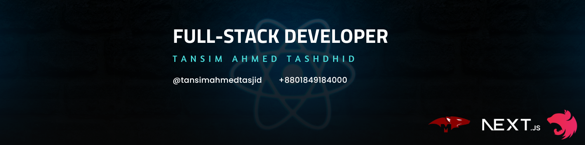

### 
I'm Tansim Ahmed Tashidd 

 A full-time full-stack developer 👨‍💻

 

Driven to master Full Stack Development, I am committed to creating innovative web solutions that blend creativity with effective problem-solving. With a focus on user experience (UI/UX, cross-platform, Responsive) and impactful design, I aim to contribute meaningfully to organizational success while continuously enhancing my skills.

 

### 💻 What I Offer:

- **Next.js Expertise:** Proficient in crafting engaging and dynamic user interfaces leveraging Next.js to deliver seamless user experiences.
- **Full-Stack Acumen:** Knowledgeable in Nest.js,Prisma,Express.js for server-side development, ensuring robust functionality, and MongoDB and PostgresSQL for efficient database management.
- **End-to-End Development:** Capable of handling the entire development cycle, from conceptualization to deployment, ensuring the creation of high-quality, scalable web applications.

 

- 🌱 I’m currently learning **Nest Js**

- 💬 Ask me about **React**

- 📫 How to reach me **tansimahmedtasjid@gmail.com**

- 📄 Know about my experiences : [Drive Link](https://drive.google.com/file/d/1vbva7P27gD_pVo1kXMSCO8BqxdHOoxeE/view?usp=drive_link)

 

# 📉Current Stats:

   

## My Skill Set

<table>
  <tr>
    <td valign="top" width="33%">
      <h3 align="center">Frontend</h3>
      

        
        
        
        
        
        
        
      

    </td>
    <td valign="top" width="33%">
      <h3 align="center">Backend</h3>
      

        
        
        
        
        
        
        
      

    </td>
    <td valign="top" width="33%">
      <h3 align="center">Tools</h3>
      

        
        
        
        
        
      

    </td>
  </tr>
</table>

 

## Connect with me

  

---

<!-- Proudly created with GPRM ( https://gprm.itsvg.in ) -->
